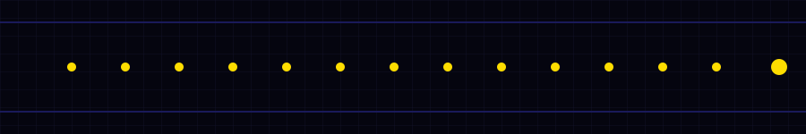

---

### 🛠️ Languages

 &nbsp; **C++** 
 &nbsp; **Java** 
 &nbsp; **Python** 
 &nbsp; **C#** 
 &nbsp; **JavaScript** 
 &nbsp; **Lua** 
 &nbsp; **HTML5** 
 &nbsp; **CSS3**

---

### 🤖 Interests

🤖 &nbsp; Robotics Programming 
🖥️ &nbsp; Desktop Applications 
🌐 &nbsp; Web Applications 
⚙️ &nbsp; Automation Scripts 
🛠️ &nbsp; Useful Tools

---

